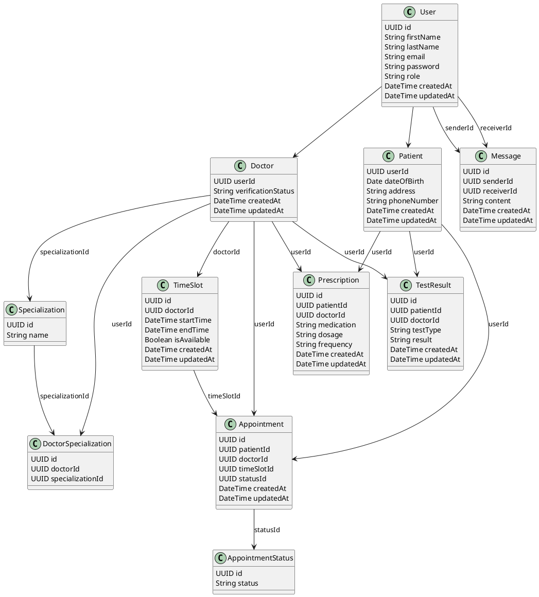

Sure, here is the updated response with the SQL code for inserting values into the `TimeSlots` table.

### Create Database

```sql
CREATE DATABASE kido_medical;
```

### Create Tables

```sql
-- Connect to the database
\c kido_medical;

-- Create Users table
CREATE TABLE Users (
    id UUID PRIMARY KEY,
    firstName VARCHAR(255) NOT NULL,
    lastName VARCHAR(255) NOT NULL,
    email VARCHAR(255) UNIQUE NOT NULL,
    password VARCHAR(255) NOT NULL,
    role VARCHAR(50) NOT NULL,
    createdAt TIMESTAMPTZ NOT NULL DEFAULT NOW(),
    updatedAt TIMESTAMPTZ NOT NULL DEFAULT NOW()
);

-- Create Specializations table
CREATE TABLE Specializations (
    id UUID PRIMARY KEY,
    name VARCHAR(255) NOT NULL UNIQUE
);

-- Create Doctors table
CREATE TABLE Doctors (
    userId UUID PRIMARY KEY,
    verificationStatus VARCHAR(50) NOT NULL DEFAULT 'PENDING',
    createdAt TIMESTAMPTZ NOT NULL DEFAULT NOW(),
    updatedAt TIMESTAMPTZ NOT NULL DEFAULT NOW(),
    FOREIGN KEY (userId) REFERENCES Users (id)
);

-- Create DoctorSpecializations table
CREATE TABLE DoctorSpecializations (
    id UUID PRIMARY KEY,
    doctorId UUID NOT NULL,
    specializationId UUID NOT NULL,
    FOREIGN KEY (doctorId) REFERENCES Doctors (userId),
    FOREIGN KEY (specializationId) REFERENCES Specializations (id)
);

-- Create Patients table
CREATE TABLE Patients (
    userId UUID PRIMARY KEY,
    dateOfBirth DATE NOT NULL,
    address VARCHAR(255) NOT NULL,
    phoneNumber VARCHAR(50) NOT NULL,
    createdAt TIMESTAMPTZ NOT NULL DEFAULT NOW(),
    updatedAt TIMESTAMPTZ NOT NULL DEFAULT NOW(),
    FOREIGN KEY (userId) REFERENCES Users (id)
);

-- Create TimeSlots table
CREATE TABLE TimeSlots (
    id UUID PRIMARY KEY,
    doctorId UUID NOT NULL,
    startTime TIMESTAMPTZ NOT NULL,
    endTime TIMESTAMPTZ NOT NULL,
    isAvailable BOOLEAN NOT NULL DEFAULT TRUE,
    createdAt TIMESTAMPTZ NOT NULL DEFAULT NOW(),
    updatedAt TIMESTAMPTZ NOT NULL DEFAULT NOW(),
    FOREIGN KEY (doctorId) REFERENCES Doctors (userId)
);

-- Create AppointmentStatuses table
CREATE TABLE AppointmentStatuses (
    id UUID PRIMARY KEY,
    status VARCHAR(50) NOT NULL
);

-- Create Appointments table
CREATE TABLE Appointments (
    id UUID PRIMARY KEY,
    patientId UUID NOT NULL,
    doctorId UUID NOT NULL,
    timeSlotId UUID NOT NULL,
    statusId UUID NOT NULL,
    createdAt TIMESTAMPTZ NOT NULL DEFAULT NOW(),
    updatedAt TIMESTAMPTZ NOT NULL DEFAULT NOW(),
    FOREIGN KEY (patientId) REFERENCES Patients (userId),
    FOREIGN KEY (doctorId) REFERENCES Doctors (userId),
    FOREIGN KEY (timeSlotId) REFERENCES TimeSlots (id),
    FOREIGN KEY (statusId) REFERENCES AppointmentStatuses (id)
);

-- Create Prescriptions table
CREATE TABLE Prescriptions (
    id UUID PRIMARY KEY,
    patientId UUID NOT NULL,
    doctorId UUID NOT NULL,
    medication VARCHAR(255) NOT NULL,
    dosage VARCHAR(255) NOT NULL,
    frequency VARCHAR(255) NOT NULL,
    createdAt TIMESTAMPTZ NOT NULL DEFAULT NOW(),
    updatedAt TIMESTAMPTZ NOT NULL DEFAULT NOW(),
    FOREIGN KEY (patientId) REFERENCES Patients (userId),
    FOREIGN KEY (doctorId) REFERENCES Doctors (userId)
);

-- Create TestResults table
CREATE TABLE TestResults (
    id UUID PRIMARY KEY,
    patientId UUID NOT NULL,
    doctorId UUID NOT NULL,
    testType VARCHAR(255) NOT NULL,
    result TEXT NOT NULL,
    createdAt TIMESTAMPTZ NOT NULL DEFAULT NOW(),
    updatedAt TIMESTAMPTZ NOT NULL DEFAULT NOW(),
    FOREIGN KEY (patientId) REFERENCES Patients (userId),
    FOREIGN KEY (doctorId) REFERENCES Doctors (userId)
);

-- Create Messages table
CREATE TABLE Messages (
    id UUID PRIMARY KEY,
    senderId UUID NOT NULL,
    receiverId UUID NOT NULL,
    content TEXT NOT NULL,
    createdAt TIMESTAMPTZ NOT NULL DEFAULT NOW(),
    updatedAt TIMESTAMPTZ NOT NULL DEFAULT NOW(),
    FOREIGN KEY (senderId) REFERENCES Users (id),
    FOREIGN KEY (receiverId) REFERENCES Users (id)
);
```

### Insert Values

```sql
-- Insert some roles (assuming ENUM values for roles)
INSERT INTO Users (id, firstName, lastName, email, password, role, createdAt, updatedAt) VALUES
('d3b07384-d9a3-4e1d-baf4-1f2db65f407c', 'Admin', 'User', 'admin@example.com', 'adminpassword', 'ADMIN', NOW(), NOW()),
('a3b07384-d9a3-4e1d-baf4-1f2db65f407d', 'John', 'Doe', 'john.doe@example.com', 'johnpassword', 'PATIENT', NOW(), NOW()),
('b3b07384-d9a3-4e1d-baf4-1f2db65f407e', 'Jane', 'Doe', 'jane.doe@example.com', 'janepassword', 'DOCTOR', NOW(), NOW());

-- Insert some specializations
INSERT INTO Specializations (id, name) VALUES
('c3b07384-d9a3-4e1d-baf4-1f2db65f407f', 'Cardiology'),
('c3b07384-d9a3-4e1d-baf4-1f2db65f4080', 'Neurology');

-- Insert doctors
INSERT INTO Doctors (userId, verificationStatus, createdAt, updatedAt) VALUES
('b3b07384-d9a3-4e1d-baf4-1f2db65f407e', 'VERIFIED', NOW(), NOW());

-- Insert doctor specializations
INSERT INTO DoctorSpecializations (id, doctorId, specializationId) VALUES
('d4b07384-d9a3-4e1d-baf4-1f2db65f4081', 'b3b07384-d9a3-4e1d-baf4-1f2db65f407e', 'c3b07384-d9a3-4e1d-baf4-1f2db65f407f');

-- Insert patients
INSERT INTO Patients (userId, dateOfBirth, address, phoneNumber, createdAt, updatedAt) VALUES
('a3b07384-d9a3-4e1d-baf4-1f2db65f407d', '1990-01-01', '123 Main St', '123-456-7890', NOW(), NOW());

-- Insert time slots
INSERT INTO TimeSlots (id, doctorId, startTime, endTime, isAvailable, createdAt, updatedAt) VALUES
('e3b07384-d9a3-4e1d-baf4-1f2db65f4081', 'b3b07384-d9a3-4e1d-baf4-1f2db65f407e', '2024-06-15 09:00:00+00', '2024-06-15 10:00:00+00', TRUE, NOW(), NOW()),
('e3b07384-d9a3-4e1d-baf4-1f2db65f4082', 'b3b07384-d9a3-4e1d-baf4-1f2db65f407e', '2024-06-15 10:00:00+00', '2024-06-15 11:00:00+00', TRUE, NOW(), NOW());

-- Insert appointment statuses
INSERT INTO AppointmentStatuses (id, status) VALUES
('f3b07384-d9a3-4e1d-baf4-1f2db65f4083', 'SCHEDULED'),
('f3b07384-d9a3-4e1d-baf4-1f2db65f4084', 'COMPLETED'),
('f3b07384-d9a3-4e1d-baf4-1f2db65f4085', 'CANCELLED');

-- Insert appointments
INSERT INTO Appointments (id, patientId, doctorId, timeSlotId, statusId, createdAt, updatedAt) VALUES
('g3b07384-d9a3-4e1d-baf4-1f2db65f4086', 'a3b07384-d9a3-4e1d-baf4-1f2db65f407d', 'b3b07384-d9a3-4e1d-baf4-1f2db65f407e', 'e3b07384-d9a3-4e1d-baf4-1f2db65f4081', 'f3b07384-d9a3-4e1d-baf4-1f2db65f4083', NOW(), NOW());

-- Insert prescriptions
INSERT INTO Prescriptions (id, patientId, doctorId, medication, dosage, frequency, createdAt, updatedAt) VALUES
('h3b07384-d9a3-4e1d-baf4-1f2db65f4087', 'a3b07384-d9a3-4e1

d-baf4-1f2db65f407d', 'b3b07384-d9a3-4e1d-baf4-1f2db65f407e', 'Aspirin', '500mg', 'Twice a day', NOW(), NOW());

-- Insert test results
INSERT INTO TestResults (id, patientId, doctorId, testType, result, createdAt, updatedAt) VALUES
('i3b07384-d9a3-4e1d-baf4-1f2db65f4088', 'a3b07384-d9a3-4e1d-baf4-1f2db65f407d', 'b3b07384-d9a3-4e1d-baf4-1f2db65f407e', 'Blood Test', 'Normal', NOW(), NOW());

-- Insert messages
INSERT INTO Messages (id, senderId, receiverId, content, createdAt, updatedAt) VALUES
('j3b07384-d9a3-4e1d-baf4-1f2db65f4089', 'a3b07384-d9a3-4e1d-baf4-1f2db65f407d', 'b3b07384-d9a3-4e1d-baf4-1f2db65f407e', 'Hello, Doctor!', NOW(), NOW()),
('j3b07384-d9a3-4e1d-baf4-1f2db65f4090', 'b3b07384-d9a3-4e1d-baf4-1f2db65f407e', 'a3b07384-d9a3-4e1d-baf4-1f2db65f407d', 'Hello, Patient!', NOW(), NOW());
```

### Diagram and Class Diagram Code (PlantUML)

Here is the PlantUML code for creating a class diagram and an ER diagram:



This PlantUML code generates a class diagram that reflects the database schema with relationships between tables. The SQL code ensures the `kido_medical` database is correctly set up, with tables created and initial data inserted.